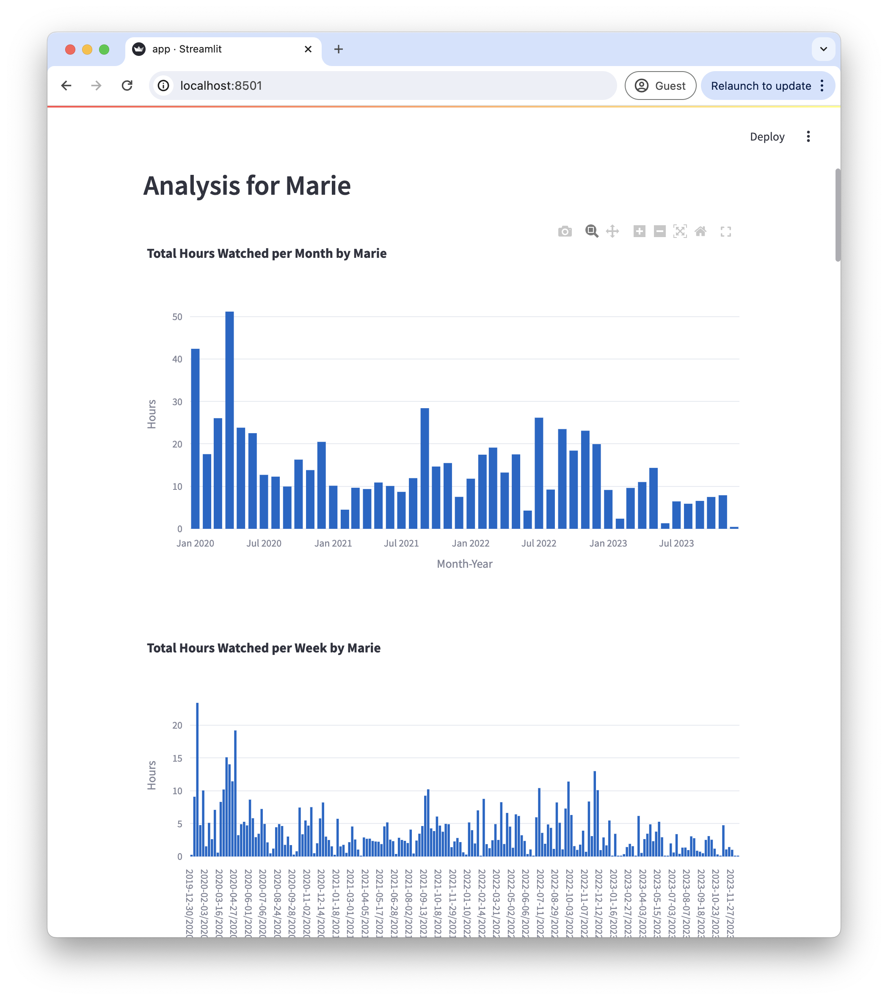

# Netflix Streaming Behavior

A lightweight app to analyze netflix viewing behavior for all users in an account. Run it in realtime: [https://netflix-stats.streamlit.app/](https://netflix-stats.streamlit.app/){:target="_blank"}

# About

Seeing everyone endulge in Netflix I was currious to understand to how many hours it actually adds up and whether any patterns could be found. 🕵️‍♂️ 

# See Your Data

To see your own data follow these steps:

1. Download your own Netflix data from [https://www.netflix.com/account/getmyinfo](https://www.netflix.com/account/getmyinfo){:target="_blank"}.
> You have to request your dataset, confirm it via email and then ~1 day later you can download it from that site. 
2. Unpack the zip file and find the `ViewingActivity.csv` under the `CONTENT_INTERACTION` folder. 
3. Upload the `ViewingActivity.csv` file into the app and you'll have all users visualized from your account.

Explore your data! 

>NOTE: Don't worry I do not save your data anywhere (look at the source code [here](https://github.com/pbieberstein/netflix-behavior). It will disappear as soon as you close the app. 